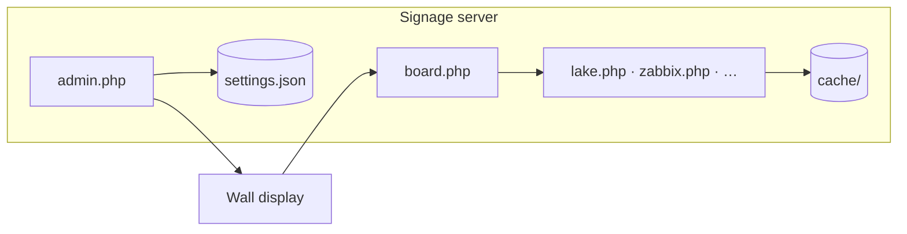

# Home Signage Boards

PHP wall displays at **1920×1080**, one shared dark-navy/amber theme. Run on **PHP 8+** with **curl**; responses cache in `./cache/` and fall back to stale data when an API fails, so the wall stays up.

| | |
|---|---|
| **Server** | Ubuntu, Debian, or Raspberry Pi OS — VM, NUC, Pi, VPS |
| **Display** | Any browser → `board.php`, or `setup-kiosk.sh` for a dedicated TV |
| **Config** | **admin.php** → `config/settings.json` (board PHP files are never edited) |



---

## Contents

| | |
|---|---|
| [Getting started](#getting-started) | Install, first login, manual requirements |
| [Admin & security](#admin--security) | Roles, ownership — [full guide](docs/admin-and-security.md) |
| [Boards](#boards) | Overview — [per-board reference](docs/boards.md) |
| [Rotation & deployment](#rotation--deployment) | Playlists, scripts — [full guide](docs/rotation-and-deployment.md) |
| [Documentation](#documentation) | Deep-dive docs in `docs/` |

---

## Getting started

### 1. Install the server

```bash
sudo bash setup-server.sh --with-video-cron
```

Creates Apache/nginx, PHP, writable dirs, and blocks direct HTTP access to secrets. See [rotation guide → setup-server.sh](docs/rotation-and-deployment.md#setup-serversh--web-host) for flags.

### 2. Open admin

Browse to **admin.php**, create your super admin (one-time key in `config/setup.key` on the server), then configure boards from the sidebar.

### 3. Point a display at rotation

```bash
# Optional — dedicated Linux kiosk:
sudo bash setup-kiosk.sh "http://your-server/boards/board.php" [scale]

# Or open in any browser:
http://your-server/boards/board.php
```

Add boards to the playlist under **Rotation**. Each screen has its own URL: `board.php?screen=garage`.

### Manual install

If you skip `setup-server.sh`:

```bash
sudo apt install apache2 libapache2-mod-php php-curl php-xml php-mbstring php-gd php-zip ffmpeg dnsutils
sudo mkdir -p /var/www/html/boards/{config,cache,videos,slides,photos}
sudo chown -R www-data:www-data /var/www/html/boards/{config,cache,videos,slides,photos}
```

**Block secret paths** — Ubuntu Apache ignores `.htaccess` until you add:

```apache
<DirectoryMatch "/var/www/html/boards/(config|cache|slides|photos)/">
    Require all denied
</DirectoryMatch>
```

**nginx:** `location ^~ /boards/(config|cache|slides|photos)/ { deny all; }`

Verify: `curl -I http://server/boards/config/settings.json` → **403**.

Prefer `pipx install yt-dlp` over apt for YouTube (repo builds go stale).

---

## Admin & security

| Role | What they can do |
|------|------------------|
| **Super admin** | Everything — users, security, all displays |
| **Operator** | Own content boards + rotation for **one** assigned display |

Operators can **own** and **share** playlist rows (slides, RSS, Zabbix pages, Splunk pages, …). Weather, homelab, and setup boards stay super-admin only. API tokens stay super-admin only.

Settings use file locking so concurrent saves on different boards merge safely. The **Users** page is the exception — last save wins if two super admins edit it at once.

→ **[Admin, SSO, and hardening](docs/admin-and-security.md)** — Entra ID, Authentik, JIT provisioning, troubleshooting

---

## Boards

All boards are configured in **admin.php**. Parameterized URLs plug into rotation:

```
rss.php?feed=krebs          grafana.php?d=homelab
zabbix.php?d=network        splunk.php?d=soc
video.php?v=drone           slides.php?slide=birthday.png
```

### At a glance

| Group | Highlights | Keys |
|-------|------------|------|
| **Weather & home** | Weather, lake, webcam, Mackinac Bridge cam, photo, air, UV index, sports, calendar, traffic | OWM, TomTom, Google Pollen (optional) |
| **Monitoring** | SignalTrace, cloud outages, internet infrastructure (BGP/DNS), internet attacks (DShield), DShield heatmap, attack origins, top ports treemap, IODA outage map, Cloudflare Radar (DDoS), L7/L3 attack maps, HIBP breaches, new CVEs, homelab (Proxmox/AdGuard), **Zabbix 7.x** (JSON-RPC, multi-page by host group) | Per-service tokens; Graph for M365; Radar token; NVD key optional; `dig` for DNS roots |
| **Daily** | Word of the day, This day in history, Dad jokes, XKCD comic | — |
| **Media** | Photo rotator, scheduled slides, RSS feeds, local video (yt-dlp) | — |
| **Dashboards** | Grafana, Splunk panels (REST), Splunk published, embedded websites | Splunk token (panels) |

**Zabbix** — no iframe; server-side `problem.get` + host status. Multiple pages (`zabbix.php?d=<key>`) filter by host group; operators can own pages per team. See [boards → Zabbix](docs/boards.md#zabbixphp--zabbix-monitoring-json-rpc-7x).

**Splunk panels** — oneshot searches server-side (port 8089), multi-page like Grafana.

**Internet attacks** (`attacks.php`) — DShield (SANS ISC) works with no API key: countries under attack, top ports, top IPs, and the global Infocon level.

**DShield heatmap** (`dshieldmap.php`) — full-screen world map of the same DShield country-target data; no API key.

**Attack origins** (`dshieldsrc.php`), **top ports** (`attackports.php`), and **IODA outage map** (`iodamap.php`) — additional DShield/IODA visualizations; no API keys.

**Attack maps** (`attackmap.php` L7, `l3map.php` L3) — Cloudflare Radar pew-pew flow maps; share the Radar API token.

**Cloudflare Radar** (`radar.php`) — separate rotation screen for L3/L7 DDoS geography. Add a **Cloudflare Radar** API token:

1. Sign in at [dash.cloudflare.com](https://dash.cloudflare.com) (free account is fine).
2. **My Profile → API Tokens → Create Token**.
3. Use the **“Read all Radar data”** template, or a custom token with **Account → Radar** permission.
4. Admin → **Cloudflare Radar** → paste into **Cloudflare API token**.
5. Choose a window (default **Last 24 hours**). Add `radar.php` to your rotation playlist as its own row.

**Attack map** (`attackmap.php`) — full-screen animated **pew-pew** map of L7 attack flows (origin → target arcs). Uses the same Radar token; add as its own rotation row (75s dwell works well).

If you previously saved a token under **Internet Attacks**, it is still read until you move it to **Cloudflare Radar**.

**Internet infrastructure** (`internet.php`) — BGP/ASN outages via IODA (no key) and DNS root probes via `dig` (`dnsutils` package; installed by `setup-server.sh`).

→ **[Full board reference](docs/boards.md)** — setup steps, scheduling, traffic troubleshooting, ticker

→ **[YouTube / video troubleshooting](docs/video-youtube.md)** — cookies, deno, bot checks

---

## Rotation & deployment

| Piece | Role |
|-------|------|
| **board.php** | Crossfades playlist; persistent weather ticker |
| **setup-server.sh** | Web host + PHP + hardening |
| **setup-kiosk.sh** | Optional fullscreen Chromium kiosk + CEC |
| **player.php** | PWA — scale rotation to any screen size |
| **Status** | Which kiosks are online, deploy sync |

Playlist features: per-page dwell, hour windows, **Skip**, **Shuffle**, **Weighted** rotation (weight 1–20), multiple displays (`?screen=`).

→ **[Rotation & deployment guide](docs/rotation-and-deployment.md)** — weighted mode, CEC, Channels DVR, standalone board URLs

---

## Documentation

| Doc | Contents |
|-----|----------|
| [docs/admin-and-security.md](docs/admin-and-security.md) | Roles, ownership, SSO (Entra/Authentik), hardening |
| [docs/boards.md](docs/boards.md) | Every board — data sources, setup, rotation URLs |
| [docs/rotation-and-deployment.md](docs/rotation-and-deployment.md) | Playlists, scripts, PWA, DVR |
| [docs/video-youtube.md](docs/video-youtube.md) | yt-dlp, cookies, headless YouTube |

---

## General notes

- Keep all files in one directory sharing `config/` and `cache/`.
- Runtime dirs: `config/`, `cache/`, `videos/`, `slides/`, `photos/`. `slide_backgrounds/` ships theme PNGs.
- Legacy `config/admin.json` migrates to `config/users.json` on first login.
- Failed API calls show a diagnostic stamp bottom-right while serving stale cache.
- `*.lock` files beside JSON during writes are normal.
