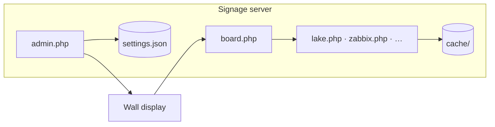

# Home Signage Boards

PHP wall displays at **1920×1080**, one shared dark-navy/amber theme. Run on **PHP 8+** with **curl**; responses cache in `./cache/` and fall back to stale data when an API fails, so the wall stays up.

| | |
|---|---|
| **Server** | Ubuntu, Debian, or Raspberry Pi OS — VM, NUC, Pi, VPS |
| **Display** | Any browser → `board.php`, or `setup-kiosk.sh` for a dedicated TV |
| **Config** | **admin.php** → `config/settings.json` (board PHP files are never edited) |



---

## Contents

| | |
|---|---|
| [Getting started](#getting-started) | Install, first login, manual requirements |
| [Kiosk display](#3-point-a-display-at-rotation) | Dedicated TV/Pi — [full guide](docs/kiosk-setup.md) |
| [Admin & security](#admin--security) | Roles, display assignment, sharing (users + roles) — [full guide](docs/admin-and-security.md) |
| [Boards](#boards) | Overview — [per-board reference](docs/boards.md) |
| [Rotation & deployment](#rotation--deployment) | Playlists, scripts — [full guide](docs/rotation-and-deployment.md) |
| [Documentation](#documentation) | Deep-dive docs in `docs/` |

---

## Getting started

### 1. Install the server

```bash
sudo bash setup-server.sh --with-video-cron
```

Creates Apache/nginx, PHP, writable dirs, and blocks direct HTTP access to secrets. See [rotation guide → setup-server.sh](docs/rotation-and-deployment.md#setup-serversh--web-host) for flags.

### 2. Open admin

Browse to **admin.php**, create your super admin (one-time key in `config/setup.key` on the server), then configure boards from the sidebar.

### 3. Point a display at rotation

**Dedicated kiosk** (Pi / mini PC → fullscreen Chromium + optional HDMI-CEC):

```bash
sudo bash setup-kiosk.sh "http://your-server/boards/board.php?screen=garage"
# 4K: add scale 2 · skip CEC: --no-cec
sudo reboot
```

→ **[Kiosk machine setup](docs/kiosk-setup.md)** — hardware, CEC, cursor, freezes, re-running after updates

**Or** open any browser / smart TV:

```
http://your-server/boards/board.php
http://your-server/boards/board.php?screen=garage
```

Add boards to the playlist under **Rotation**. Each screen has its own URL: `board.php?screen=<key>`.

### Manual install

If you skip `setup-server.sh`:

```bash
sudo apt install apache2 libapache2-mod-php php-curl php-xml php-mbstring php-gd php-zip ffmpeg dnsutils
sudo mkdir -p /var/www/html/boards/{config,cache,videos,slides,photos}
sudo chown -R www-data:www-data /var/www/html/boards/{config,cache,videos,slides,photos}
```

**Block secret paths** — Ubuntu Apache ignores `.htaccess` until you add:

```apache
<DirectoryMatch "/var/www/html/boards/(config|cache|slides|photos)/">
    Require all denied
</DirectoryMatch>
```

**nginx:** `location ^~ /boards/(config|cache|slides|photos)/ { deny all; }`

Verify: `curl -I http://server/boards/config/settings.json` → **403**.

Prefer `pipx install yt-dlp` over apt for YouTube (repo builds go stale).

---

## Admin & security

| Role | What they can do |
|------|------------------|
| **Super admin** | Everything — users, security, all displays |
| **Infrastructure** | Operator access plus Homelab, UniFi, SignalTrace, Uptime Kuma, Tailscale, and ntfy admin boards |
| **Operator** | Own content boards + rotation for assigned display(s) — **one** by default, or **multiple** when **Security → Operators may manage multiple displays** is enabled |

Operators and infrastructure users can **own** content and grant access to **individual users** or **roles** (e.g. all **Operators** or **Infrastructure**) on playlist rows. Homelab, UniFi, SignalTrace, Uptime Kuma, Tailscale, and ntfy **admin** stay limited to super admins and infrastructure users; those boards are also omitted from operator rotation quick-add and hero-strip sources (other monitoring walls such as Cloudflare Radar and shared Zabbix pages remain available). Other setup/security boards stay super-admin only. API tokens on most boards stay super-admin **Board settings**.

The admin **sidebar groups** (Setup, Weather & home, Monitoring, …) are **collapsible** — click a category header to expand or collapse; your choices are remembered in the browser.

**Users** assigns each display to **one operator** (primary owner). Enable **Security → Operators may manage multiple displays** (default on) to give one person several screens; the display picker then lists only **unassigned** displays and that operator’s **current** assignments — screens owned by someone else are hidden so you cannot accidentally assign the same TV twice. Toggle the same setting on the **Users** page when saving accounts.

Settings use file locking so concurrent saves on different boards merge safely. The **Users** page is the exception — last save wins if two super admins edit it at once.

→ **[Admin, SSO, and hardening](docs/admin-and-security.md)** — Entra ID, Authentik, JIT provisioning, troubleshooting

---

## Boards

All boards are configured in **admin.php**. Parameterized URLs plug into rotation:

```
rss.php?feed=krebs              glance.php
grafana.php?d=homelab           calendar.php
zabbix.php?d=network            splunk.php?d=soc
webcam.php?cam=grpm             webcam.php?cam=grandhaven
camwall.php                     traffic.php
ransomware.php                  phish.php
kev.php                         certexp.php
video.php?v=drone               slides.php?slide=birthday.png
```

### At a glance

| Group | Highlights | Keys |
|-------|------------|------|
| **Weather & home** | Weather, lake, webcam, **MDOT cams**, Mackinac Bridge cam, photo, air, UV index, sports, calendar, **today at a glance**, meal calendar, traffic | OWM, TomTom, Google Pollen (optional) |
| **Monitoring** | SignalTrace, cloud outages, internet infrastructure (BGP/DNS), internet attacks (DShield), DShield heatmap, attack origins, top ports treemap, IODA outage map, Cloudflare Radar (DDoS), L7/L3 attack maps, HIBP breaches, new CVEs, **CISA KEV**, **TLS cert expiry**, **ransomware tracker**, **phishing & brand threats**, homelab (Proxmox/AdGuard), **UniFi Network**, **Uptime Kuma**, **Tailscale**, **ntfy**, **Zabbix 7.x** (JSON-RPC, multi-page by host group) | Per-service tokens; Graph for M365; Radar token; NVD key optional; URLhaus Auth-Key; `dig` for DNS roots |
| **Daily** | Word of the day, This day in history, Dad jokes, **Announcements / countdown**, XKCD comic | — |
| **Media** | Photo rotator, scheduled slides (upload + **slide creator** with occasion templates — dinner menu, snow day, anniversary, …), RSS feeds (portrait-friendly **image fit**), local video (yt-dlp) | — |
| **Dashboards** | Grafana, Splunk panels (REST), Splunk published, Power BI, embedded websites | Grafana JWT secret (SSO embed); Splunk token (panels); Azure app (Power BI private) |

**Zabbix** — no iframe; server-side `problem.get` + host status. Problems are filtered to match the Zabbix UI (unresolved only; excludes disabled triggers/hosts/items and symptom events that `problem.get` still returns). Multiple pages (`zabbix.php?d=<key>`) filter by host group; operators can own pages per team. If the wall shows an alert you cannot find in Zabbix, run `php scripts/diagnose-zabbix.php <page_key> [--needle=substring]` on the server — **HIDDEN** rows are API-only leftovers (e.g. a Docker trigger disabled after a container was removed). See [boards → Zabbix](docs/boards.md#zabbixphp--zabbix-monitoring-json-rpc-7x).

**Splunk panels** — oneshot searches server-side (port 8089), multi-page like Grafana.

**Grafana** (`grafana.php?d=<key>`) — iframe with kiosk mode. For **SSO-protected self-hosted Grafana**, enable **JWT auth for embed** in admin; signage signs `auth_token` URLs validated by Grafana `[auth.jwt]`. Setup: [docs/grafana.md](docs/grafana.md).

**Power BI** (`powerbi.php?d=<key>`) — publish-to-web for public reports, or **Azure AD embed tokens** for private reports on unattended players (same model as Yodeck). Step-by-step Entra and Power BI admin setup: [docs/powerbi.md](docs/powerbi.md).

**Internet attacks** (`attacks.php`) — DShield (SANS ISC) works with no API key: countries under attack, top ports, top IPs, and the global Infocon level.

**DShield heatmap** (`dshieldmap.php`) — full-screen world map of the same DShield country-target data; no API key.

**Attack origins** (`dshieldsrc.php`), **top ports** (`attackports.php`), and **IODA outage map** (`iodamap.php`) — additional DShield/IODA visualizations; no API keys.

**Attack maps** (`attackmap.php` L7, `l3map.php` L3) — Cloudflare Radar pew-pew flow maps; share the Radar API token.

**Cloudflare Radar** (`radar.php`) — separate rotation screen for L3/L7 DDoS geography. Add a **Cloudflare Radar** API token:

1. Sign in at [dash.cloudflare.com](https://dash.cloudflare.com) (free account is fine).
2. **My Profile → API Tokens → Create Token**.
3. Use the **“Read all Radar data”** template, or a custom token with **Account → Radar** permission.
4. Admin → **Cloudflare Radar** → paste into **Cloudflare API token**.
5. Choose a window (default **Last 24 hours**). Add `radar.php` to your rotation playlist as its own row.

**Attack map** (`attackmap.php`) — full-screen animated **pew-pew** map of L7 attack flows (origin → target arcs). Uses the same Radar token; add as its own rotation row (75s dwell works well).

If you previously saved a token under **Internet Attacks**, it is still read until you move it to **Cloudflare Radar**.

**Internet infrastructure** (`internet.php`) — BGP/ASN outages via IODA (no key) and DNS root probes via `dig` (`dnsutils` package; installed by `setup-server.sh`).

**CISA KEV** (`kev.php`) — [Known Exploited Vulnerabilities](https://www.cisa.gov/known-exploited-vulnerabilities-catalog) catalog with remediation due dates, optional vendor filters, and ransomware-use flags. Free JSON feed (default cache 1 h). Admin → **CISA KEV**; add to rotation (~60s).

**TLS cert expiry** (`certexp.php`) — Direct TLS probes of configured HTTPS hosts; highlights certs expiring within your warn window. Admin → **TLS Cert Expiry** — add host rows; LAN endpoints must be reachable from PHP on the signage server.

**Ransomware tracker** (`ransomware.php`) — Recent **extortion-site victim claims** from [Ransomware.live](https://www.ransomware.live/) (group, sector, country, optional infostealer counts). Strategic awareness — **not** homelab alerts. Claims are **unverified** until press corroboration; the board never links to `.onion` URLs.

**Data:** `GET https://api.ransomware.live/v2/recentvictims` — free, **no API key** (rate limit 1 request/min; default cache 30 min).

**Setup:** admin → **Ransomware Tracker** — lookback days (default 7), highlight country (default **US**), optional **Watch sectors** / **Watch groups** (comma-separated, e.g. `Healthcare, Education` and `akira, qilin`). Add `ransomware.php` to rotation (~60s dwell).

**Phishing & brand threats** (`phish.php`) — Two panels: **Brand watch** (Certificate Transparency lookalikes for your domains via crt.sh) and **URLhaus recent** (malware/phishing URLs from abuse.ch). Malicious hosts are **defanged** on the wall — not clickable links.

| Panel | Source | Key |
|-------|--------|-----|
| URLhaus recent | [urlhaus-api.abuse.ch](https://urlhaus.abuse.ch/api/) | **Auth-Key required** (free) |
| Brand watch | [crt.sh](https://crt.sh/) | None (slow — cached 24h per domain) |

**Setup — URLhaus Auth-Key (one time):**

1. Create a free account at [auth.abuse.ch](https://auth.abuse.ch/).
2. Copy your **Auth-Key** from the portal.
3. Admin → **Phishing & Brand Threats** → paste into **URLhaus Auth-Key** → **Save**.
4. Optional: **Tags include** — comma-separated filters (`emotet`, `qakbot`, `cobalt`, …). Blank = all recent URLs.
5. Add **Brand watch** rows — **Root domain** (e.g. `gvsu.edu`, `vdrs.fyi`) and **Keywords** to match suspicious hostname patterns. crt.sh scans run at most once per day per domain.
6. Add `phish.php` to rotation (~60s dwell). Poll URLhaus no more often than every **5 minutes** (default cache 900s).

**UniFi Network** (`unifi.php`) — Dream Machine / UCG / UDM via local admin login (most installs) or optional Integration API key (Network 9.3+). Shows device grid, client counts, health pills, **WAN download/upload**, **top talkers**, and **last speed test** when available. Requires **Security → Allow private URL fetches** for LAN controllers. Add via **Rotation** → pick target display → quick-add **UniFi network**.

**Uptime Kuma** (`kuma.php?d=<key>`) — Monitor grid from your Kuma instance. Add **pages** in admin — each with its own **status page slug** (no API key required) and/or the board **API key**. Summary counts plus a **Down now** panel. LAN Kuma needs **Allow private URL fetches**. Quick-add per page under **Uptime Kuma** in Rotation.

**Announcements** (`announce.php?d=<key>`) — Full-screen message or countdown per row. Mark **Strip only** to keep an item off the rotation playlist and show it in the **hero status strip** instead (see below).

**Tailscale** (`tailscale.php`) — Device grid from your tailnet (API key with read devices). Quick-add under **Monitoring** when configured.

**ntfy** (`ntfy.php`) — Recent alerts from webhook (`ntfy_webhook.php`) and/or **poll topic** mode. Use in rotation or wire into the hero strip.

**Hero status strip** — Optional persistent bar above the weather ticker on `board.php` (per display under **Rotation → Display options**). Combine up to four sources (Kuma, Zabbix, announcement, ntfy for super admin / Infrastructure; Zabbix and announcements for operators). Each slot has a **Source** dropdown and a **Page / item** picker that lists every configured Kuma status page, Zabbix page, or announcement — not just “Default”. Polls every 30s with the rotation shell.

**Lake Michigan** (`lake.php`) — NDBC buoy + NWS shoreline alerts + sunset. Nearshore buoys are seasonal (~Apr–Oct). When data goes stale the board still renders (offline message, alerts, sun times). **Rotation auto-skips** `lake.php` after **24 hours** with no fresh buoy observations and puts it back when the buoy is live again — no manual Skip toggle each winter. Open `lake.php` directly any time to see the offline layout.

**Live webcams** (`webcam.php?cam=<key>`) — Full-screen feeds with **one camera per rotation slot** (same pattern as `zabbix.php?d=` or RSS feeds). Built-in cameras:

| Key | Source |
|-----|--------|
| `grpm` | [Grand Rapids Public Museum](https://www.wmta.org/live-west-michigan-camera-gallery/grand-rapids-public-museum-west-michigan-live-camera/) live stream (WMTA / WetMet iframe) |
| `grandhaven` | [Grand Haven beach](https://surfgrandhaven.com) EarthCam embed (iframe) |

Add each camera you want as its own playlist line — intermix with weather, Zabbix, Splunk, etc.:

```
webcam.php?cam=grpm
webcam.php?cam=grandhaven
```

Admin → **Webcam** → **Cameras** — override built-in names/URLs or add rows with a unique **Key** (`?cam=yourkey`). Each camera appears in **Rotation → Add boards** quick-add (e.g. **Webcam — GR Public Museum**). Set **Off** on a row to hide it from quick-add. Still-image cameras refresh on a timer; iframe streams use an hourly reload backstop. **Rotation auto-skips** a camera after **24 hours** of failed probe checks and restores it when the feed responds again. Do not use plain `webcam.php` without `?cam=` — pick a keyed slot instead.

**MDOT cams** (`camwall.php`) — A **3×4 grid** of live still-image traffic cameras on one rotation slot (unlike `webcam.php`, which is one full-screen feed per playlist line). Ships with a built-in **Allendale ↔ Grand Rapids** corridor preset on **I-96**, **I-196**, and **US-131** (MDOT [Mi Drive](https://mdotjboss.state.mi.us/MiDrive/map) snapshot URLs, proxied server-side via `camwall_img.php` so the kiosk never hits MDOT directly). Labels sit at the top of each tile so the weather/news ticker does not cover them.

**Setup:** no API key — add `camwall.php` to rotation (~90–120s dwell pairs well with **`traffic.php`** TomTom flow map). Admin → **MDOT Cams** → set title/subtitle, grid size (**Cols** × **Rows**, default 3×4 = 12 tiles), and refresh interval (default 45s).

**Customize the built-in wall** — Under **Cameras**, each row overrides or extends the preset:

| Column | Purpose |
|--------|---------|
| **Key** | Slot id (e.g. `i96-24th`). Match a built-in key to override that tile; use a new key to add one. |
| **Label** | Name under the route badge |
| **Route badge** | Short tag shown on the tile (e.g. `I-96`, `US-131`) |
| **Snapshot URL** | Direct `.jpg` still URL — see below |
| **Order** | Sort order (lower = earlier in the grid, top-left first) |
| **Off** | Hide this slot |

Set **Off** on a built-in key to drop it from the grid. Cameras beyond **Cols × Rows** are not shown. Duplicate snapshot URLs are deduplicated automatically.

**Add your own cameras (any install):**

1. Find a **direct still-image URL** (not the Mi Drive map page — that is not embeddable). For Michigan MDOT feeds, open [Mi Drive → Cameras](https://mdotjboss.state.mi.us/MiDrive/cameras), pick a camera, and copy the image `src` (usually `https://micamerasimages.net/thumbs/….flv.jpg?item=1`). Some RWIS cams use `https://mdotjboss.state.mi.us/docs/drive/camfiles/rwis/<id>.jpg`.
2. Admin → **MDOT Cams** → **Cameras** → add a row with a unique **Key** (e.g. `us131-market`), **Label**, optional **Route badge**, **Snapshot URL**, and **Order**.
3. Save, then open `camwall.php` in a browser to confirm the tile loads.
4. Add **`camwall.php`** to your rotation playlist (or use quick-add **MDOT Cams**).

To replace the whole corridor for another region, add rows for the cameras you want (with sort order 1–12), set **Off** on any built-in keys you do not need, or clear unused defaults by overriding them with your URLs under the same keys. Only **`micamerasimages.net`** and **`mdotjboss.state.mi.us`** snapshot hosts are allowed (server-side safety check).

MDOT feeds are refreshed stills, not video; thumbs are modest resolution (~720×480 source) — fine for “is traffic moving?” on a wall. [Mi Drive disclaimer](https://www.michigan.gov/mdot/about/mi-drive-disclaimer) applies.

**Mackinac Bridge cam** (`bridgecam.php`) — Four still-image views from the Mackinac Bridge Authority; one camera or rotate all four on a single board (unlike `webcam.php`, which is one cam per rotation entry). Admin → **Mackinac Bridge Cam** — no API key.

**Sports** (`sports.php`) — ESPN scoreboards for up to **four teams per display** (NFL/MLB/NBA/NHL plus NCAAF, NCAAM, NCAAW, WNBA, MLS). Set teams, optional title, and subtitle under **Rotation → Display options**; global defaults under **Sports** in admin. Standalone views poll for live score updates; in rotation the board reloads with the shell. Adaptive layout (1–4 teams), live clock, streaks, and opponent logos on game days.

**Weather ticker** — Lives in the rotation shell (`board.php`), not inside each iframe. Polls NWS at the kiosk’s configured location every 30s (15s in demo mode) so alerts appear without a full page reload. Alert text shows timing and hazards — not long county lists (alerts are already point-specific). **Location:** global lat/lon on the **Weather** board; override per display under **Rotation → Kiosk settings** (same coordinates used for weather, air, UV, photo, traffic, and NWS alerts). Per display: enable **Bottom ticker** under kiosk settings, and optionally pick an **RSS feed for when there are no weather alerts** (headlines from **RSS Stories**; weather always wins when NWS has alerts). Master on/off: **Alert Ticker** in admin (no separate lat/lon there anymore).

**Today at a glance** (`glance.php`) — Compact today/tomorrow calendar, weather summary, and two headline columns (GVNext scrape + RSS by default). Site defaults under **Today at a Glance**; per-display headline URLs/feeds under **Rotation → Kiosk settings**. In rotation, `board.php` passes `?screen=` so kiosk overrides apply (same as sports and weather boards).

**Meal calendar** (`meals.php`) — Rolling **7-day meal plan** with today highlighted. Edit weekly defaults and **date overrides** (takeout night, holidays) under **Meal calendar** in admin — no external calendar feed. Pairs with the **Dinner menu** slide creator template and the built-in **Kitchen weeknight** rotation preset.

**Per-display overrides** — Under **Rotation → Kiosk settings** for each display: transition timings, blank hours, **location** (weather, air, UV, photo, traffic map, **NWS alert ticker**), **sports teams** / title / subtitle, **glance headline columns** (left page URL / RSS fallback, right RSS feed), **hero strip** slots, and **news ticker fallback** (above). Leave location blank to use global **Weather** coordinates.

**Shared display editing** — Super admins assign **shared editors** on each display (Rotation). Shared editors manage the **full screen**: playlist, display options, hero strip, and deploy targets — including the primary owner’s slides and quick-add boards.

**Emergency override** — Super admins: **Rotation → Emergency override**. Three modes affect **all displays** within ~30s: **forced ticker** (your message in the alert bar over normal rotation; optional **NWS weather alerts** alongside), **full-screen announcement** (inline text or an existing announce item), or **emergency playlist** (same replacement playlist everywhere). Optional **auto-release**, **ntfy** notify on activate/release, and a banner on **Status**. **Release** restores normal behavior; operator rotation edits are blocked while active.

**RSS stories** (`rss.php?feed=<key>`) — **Image fit** under **RSS Stories** (global) or per feed: **auto** (default — landscape fills the screen; portrait posters show full height on the right with a blurred backdrop), **cover**, or **contain**. Useful for poster-style feeds (e.g. portrait artwork).

→ **[Full board reference](docs/boards.md)** — setup steps, scheduling, traffic troubleshooting, ticker

→ **[YouTube / video troubleshooting](docs/video-youtube.md)** — cookies, deno, bot checks

---

## Rotation & deployment

| Piece | Role |
|-------|------|
| **board.php** | Crossfades playlist; persistent weather ticker (+ optional RSS headlines when no NWS alerts); polls for config changes |
| **setup-server.sh** | Web host + PHP + hardening |
| **setup-kiosk.sh** | Fullscreen Chromium kiosk + CEC — [guide](docs/kiosk-setup.md) |
| **player.php** | PWA — scale rotation to any screen size |
| **Status** | Which kiosks are online, deploy sync |

Playlist features: per-page dwell, time windows (multiple ranges, optional weekdays, `7:30` minute precision), **calendar overrides** from ICS events, **Skip**, **Shuffle** (random order — every in-window board once per cycle), **Weighted** rotation (weight = slots per shuffled cycle; every board at least once before repeat), multiple displays (`?screen=`). The shell **polls for config changes every ~30s** and reloads when the playlist or display options change.

**Auto-skip (saved playlist unchanged):** **`lake.php`** when its buoy has been offline 24h+; **`sports.php`** when every team is off-season; **`webcam.php?cam=…`** per camera when that feed fails probes for 24h+. Boards return automatically when data is back.

Under **Rotation**, each display playlist has three setup tabs: **Add boards** (searchable quick-add), **Kiosk settings** (location, sports teams, glance headlines, hero strip, ticker, rotation mode, news fallback), and **Templates** — built-in **Kitchen weeknight**, **Weekly planner**, and **Security wall** presets, plus save/load your own (`rotation.PLAYLIST_TEMPLATES`). Expanded playlists show a **Plays now** panel (eligible rows + weighted pick %). Use **Add to display** before quick-adding so the board lands on the right playlist (e.g. `veddersg`, not `main`).

Operators with **multiple displays** assigned (see [Admin & security](#admin--security)) see and edit every playlist they own; **shared editors** get the same control on displays they are invited to. Deploy pickers (slides, photos, RSS, video) target any display they may fully edit.

→ **[Kiosk machine setup](docs/kiosk-setup.md)** — Pi / Ubuntu display box  
→ **[Rotation & deployment guide](docs/rotation-and-deployment.md)** — shuffle vs weighted, hero strip, glance per-display, shared editing, CEC schedules, Channels DVR, standalone board URLs

---

## Documentation

| Doc | Contents |
|-----|----------|
| [docs/kiosk-setup.md](docs/kiosk-setup.md) | **Dedicated display machines** — `setup-kiosk.sh`, CEC, cursor, freezes, updates |
| [docs/admin-and-security.md](docs/admin-and-security.md) | Roles, display assignment, shared editors, emergency override, ownership & sharing, SSO, hardening |
| [docs/boards.md](docs/boards.md) | Every board — data sources, setup, rotation URLs |
| [docs/grafana.md](docs/grafana.md) | **Grafana JWT embed** — SSO + self-hosted, JWK file, signage auth_token, troubleshooting |
| [docs/powerbi.md](docs/powerbi.md) | **Power BI private embed** — Entra app registration, API permissions, workspace access, RLS, troubleshooting |
| [docs/rotation-and-deployment.md](docs/rotation-and-deployment.md) | Playlists, hero strip, shared editing, emergency override, server scripts, PWA, DVR |
| [docs/video-youtube.md](docs/video-youtube.md) | yt-dlp, cookies, headless YouTube |

---

## General notes

### Project layout

Board entry URLs stay at the web root (`index.php`, `unifi.php`, `traffic.php`, …) as **thin stubs** that load implementations from `boards/<group>/`. Shared libraries live in `lib/` (`SIGNAGE_ROOT` in `config.php`). After `git pull`, run `setup-server.sh` so stubs and paths stay in sync.

| Path | Purpose |
|------|---------|
| `lib/` | `*_lib.php` — API clients, rotation, users, slides, etc. |
| `boards/weather/`, `boards/monitoring/`, `boards/media/`, … | Board implementations |
| `config/` | `settings.json`, `users.json` (not web-accessible) |
| `cache/` | API response cache |
| `videos/`, `slides/`, `photos/` | Uploaded media |

Runtime dirs: `config/`, `cache/`, `videos/`, `slides/`, `photos/`. `slide_backgrounds/` ships theme PNGs.

- Legacy `config/admin.json` migrates to `config/users.json` on first login.
- Failed API calls show a diagnostic stamp bottom-right while serving stale cache.
- `*.lock` files beside JSON during writes are normal.

### Deploy after updates

```bash
cd ~/signage-suite && git pull
sudo bash setup-server.sh --skip-apt --source ~/signage-suite --webroot /var/www/html/boards
```

Clear board-specific cache if needed (e.g. `cache/unifi_wall.json` after UniFi changes).

### CLI diagnostics

Run from the boards install root on the server (the directory with `config/settings.json`, usually `/var/www/html/boards`). If you run from a git clone without local settings, the script auto-detects that path. Override with `SIGNAGE_ROOT` or `--root=`.

```bash
# Zabbix: API vs wall — HIDDEN = in DB but not in Zabbix UI (disabled trigger/host/item)
php scripts/diagnose-zabbix.php network --needle=signaltrace
# from a clone: SIGNAGE_ROOT=/var/www/html/boards php ~/signage-suite/scripts/diagnose-zabbix.php main

# Rotation: shuffle/weighted decks, eligible pages, per-slide weights, lake/sports/webcam auto-skip
php scripts/diagnose-rotation.php veddersg

# Slides: time windows, weekdays, schedule summary (CI-friendly)
php scripts/test-slide-scheduling.php

# CISA KEV / TLS cert expiry / phishing feeds
php scripts/diagnose-kev.php
php scripts/diagnose-certexp.php
php scripts/diagnose-phish.php

# Air & Pollen: AirNow key, EPA monitor AQI, NWS alerts, Open-Meteo model
php scripts/diagnose-air.php --root=/var/www/html/boards
```
