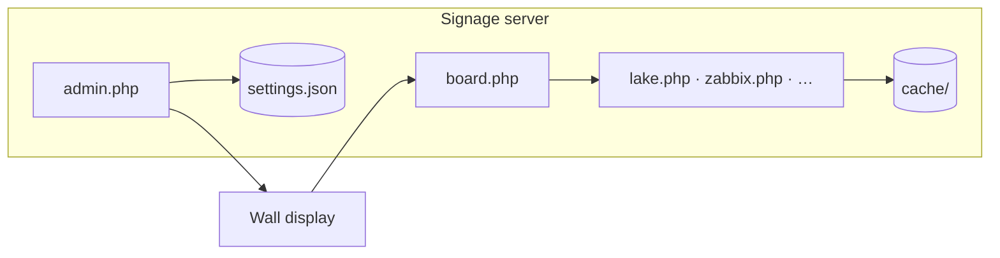

# Home Signage Boards

PHP wall displays at **1920×1080**, one shared dark-navy/amber theme. Run on **PHP 8+** with **curl**; responses cache in `./cache/` and fall back to stale data when an API fails, so the wall stays up.

| | |
|---|---|
| **Server** | Ubuntu, Debian, or Raspberry Pi OS — VM, NUC, Pi, VPS |
| **Display** | Any browser → `board.php`, or `setup-kiosk.sh` for a dedicated TV |
| **Config** | **admin.php** → `config/settings.json` (board PHP files are never edited) |



---

## Contents

| | |
|---|---|
| [Getting started](#getting-started) | Install, first login, manual requirements |
| [Kiosk display](#3-point-a-display-at-rotation) | Dedicated TV/Pi — [full guide](docs/kiosk-setup.md) |
| [Admin & security](#admin--security) | Roles, display assignment, sharing (users + roles) — [full guide](docs/admin-and-security.md) |
| [Boards](#boards) | Overview — [per-board reference](docs/boards.md) |
| [Rotation & deployment](#rotation--deployment) | Playlists, scripts — [full guide](docs/rotation-and-deployment.md) |
| [Documentation](#documentation) | Deep-dive docs in `docs/` |

---

## Getting started

### 1. Install the server

```bash
sudo bash setup-server.sh --with-video-cron
```

Creates Apache/nginx, PHP, writable dirs, and blocks direct HTTP access to secrets. See [rotation guide → setup-server.sh](docs/rotation-and-deployment.md#setup-serversh--web-host) for flags.

### 2. Open admin

Browse to **admin.php**, create your super admin (one-time key in `config/setup.key` on the server), then configure boards from the sidebar.

### 3. Point a display at rotation

**Dedicated kiosk** (Pi / mini PC → fullscreen Chromium + optional HDMI-CEC):

```bash
sudo bash setup-kiosk.sh "http://your-server/boards/board.php?screen=garage"
# 4K: add scale 2 · skip CEC: --no-cec
sudo reboot
```

→ **[Kiosk machine setup](docs/kiosk-setup.md)** — hardware, CEC, cursor, freezes, re-running after updates

**Or** open any browser / smart TV:

```
http://your-server/boards/board.php
http://your-server/boards/board.php?screen=garage
```

Add boards to the playlist under **Rotation**. Each screen has its own URL: `board.php?screen=<key>`.

### Manual install

If you skip `setup-server.sh`:

```bash
sudo apt install apache2 libapache2-mod-php php-curl php-xml php-mbstring php-gd php-zip ffmpeg dnsutils
sudo mkdir -p /var/www/html/boards/{config,cache,videos,slides,photos}
sudo chown -R www-data:www-data /var/www/html/boards/{config,cache,videos,slides,photos}
```

**Block secret paths** — Ubuntu Apache ignores `.htaccess` until you add:

```apache
<DirectoryMatch "/var/www/html/boards/(config|cache|slides|photos)/">
    Require all denied
</DirectoryMatch>
```

**nginx:** `location ^~ /boards/(config|cache|slides|photos)/ { deny all; }`

Verify: `curl -I http://server/boards/config/settings.json` → **403**.

Prefer `pipx install yt-dlp` over apt for YouTube (repo builds go stale).

---

## Admin & security

| Role | What they can do |
|------|------------------|
| **Super admin** | Everything — users, security, all displays |
| **Infrastructure** | Operator access plus Homelab, UniFi, and SignalTrace admin boards |
| **Operator** | Own content boards + rotation for assigned display(s) — **one** by default, or **multiple** when **Security → Operators may manage multiple displays** is enabled |

Operators and infrastructure users can **own** content and grant access to **individual users** or **roles** (e.g. all **Operators** or **Infrastructure**) on playlist rows. Homelab, UniFi, and SignalTrace admin stay limited to super admins and infrastructure users. Other setup/security boards stay super-admin only. API tokens on most boards stay super-admin **Board settings**.

The admin **sidebar groups** (Setup, Weather & home, Monitoring, …) are **collapsible** — click a category header to expand or collapse; your choices are remembered in the browser.

**Users** assigns each display to **one operator** (primary owner). Enable **Security → Operators may manage multiple displays** (default on) to give one person several screens; the display picker then lists only **unassigned** displays and that operator’s **current** assignments — screens owned by someone else are hidden so you cannot accidentally assign the same TV twice. Toggle the same setting on the **Users** page when saving accounts.

Settings use file locking so concurrent saves on different boards merge safely. The **Users** page is the exception — last save wins if two super admins edit it at once.

→ **[Admin, SSO, and hardening](docs/admin-and-security.md)** — Entra ID, Authentik, JIT provisioning, troubleshooting

---

## Boards

All boards are configured in **admin.php**. Parameterized URLs plug into rotation:

```
rss.php?feed=krebs          grafana.php?d=homelab
zabbix.php?d=network        splunk.php?d=soc
video.php?v=drone           slides.php?slide=birthday.png
```

### At a glance

| Group | Highlights | Keys |
|-------|------------|------|
| **Weather & home** | Weather, lake, webcam, Mackinac Bridge cam, photo, air, UV index, sports, calendar, traffic | OWM, TomTom, Google Pollen (optional) |
| **Monitoring** | SignalTrace, cloud outages, internet infrastructure (BGP/DNS), internet attacks (DShield), DShield heatmap, attack origins, top ports treemap, IODA outage map, Cloudflare Radar (DDoS), L7/L3 attack maps, HIBP breaches, new CVEs, homelab (Proxmox/AdGuard), **UniFi Network**, **Uptime Kuma**, **Tailscale**, **ntfy**, **Zabbix 7.x** (JSON-RPC, multi-page by host group) | Per-service tokens; Graph for M365; Radar token; NVD key optional; `dig` for DNS roots |
| **Daily** | Word of the day, This day in history, Dad jokes, **Announcements / countdown**, XKCD comic | — |
| **Media** | Photo rotator, scheduled slides, RSS feeds (portrait-friendly **image fit**), local video (yt-dlp) | — |
| **Dashboards** | Grafana, Splunk panels (REST), Splunk published, embedded websites | Splunk token (panels) |

**Zabbix** — no iframe; server-side `problem.get` + host status. Problems are filtered to match the Zabbix UI (unresolved only; excludes disabled triggers/hosts/items and symptom events that `problem.get` still returns). Multiple pages (`zabbix.php?d=<key>`) filter by host group; operators can own pages per team. If the wall shows an alert you cannot find in Zabbix, run `php scripts/diagnose-zabbix.php <page_key> [--needle=substring]` on the server — **HIDDEN** rows are API-only leftovers (e.g. a Docker trigger disabled after a container was removed). See [boards → Zabbix](docs/boards.md#zabbixphp--zabbix-monitoring-json-rpc-7x).

**Splunk panels** — oneshot searches server-side (port 8089), multi-page like Grafana.

**Internet attacks** (`attacks.php`) — DShield (SANS ISC) works with no API key: countries under attack, top ports, top IPs, and the global Infocon level.

**DShield heatmap** (`dshieldmap.php`) — full-screen world map of the same DShield country-target data; no API key.

**Attack origins** (`dshieldsrc.php`), **top ports** (`attackports.php`), and **IODA outage map** (`iodamap.php`) — additional DShield/IODA visualizations; no API keys.

**Attack maps** (`attackmap.php` L7, `l3map.php` L3) — Cloudflare Radar pew-pew flow maps; share the Radar API token.

**Cloudflare Radar** (`radar.php`) — separate rotation screen for L3/L7 DDoS geography. Add a **Cloudflare Radar** API token:

1. Sign in at [dash.cloudflare.com](https://dash.cloudflare.com) (free account is fine).
2. **My Profile → API Tokens → Create Token**.
3. Use the **“Read all Radar data”** template, or a custom token with **Account → Radar** permission.
4. Admin → **Cloudflare Radar** → paste into **Cloudflare API token**.
5. Choose a window (default **Last 24 hours**). Add `radar.php` to your rotation playlist as its own row.

**Attack map** (`attackmap.php`) — full-screen animated **pew-pew** map of L7 attack flows (origin → target arcs). Uses the same Radar token; add as its own rotation row (75s dwell works well).

If you previously saved a token under **Internet Attacks**, it is still read until you move it to **Cloudflare Radar**.

**Internet infrastructure** (`internet.php`) — BGP/ASN outages via IODA (no key) and DNS root probes via `dig` (`dnsutils` package; installed by `setup-server.sh`).

**UniFi Network** (`unifi.php`) — Dream Machine / UCG / UDM via local admin login (most installs) or optional Integration API key (Network 9.3+). Shows device grid, client counts, health pills, **WAN download/upload**, **top talkers**, and **last speed test** when available. Requires **Security → Allow private URL fetches** for LAN controllers. Add via **Rotation** → pick target display → quick-add **UniFi network**.

**Uptime Kuma** (`kuma.php?d=<key>`) — Monitor grid from your Kuma instance. Add **pages** in admin — each with its own **status page slug** (no API key required) and/or the board **API key**. Summary counts plus a **Down now** panel. LAN Kuma needs **Allow private URL fetches**. Quick-add per page under **Uptime Kuma** in Rotation.

**Announcements** (`announce.php?d=<key>`) — Full-screen message or countdown per row. Mark **Strip only** to keep an item off the rotation playlist and show it in the **hero status strip** instead (see below).

**Tailscale** (`tailscale.php`) — Device grid from your tailnet (API key with read devices). Quick-add under **Monitoring** when configured.

**ntfy** (`ntfy.php`) — Recent alerts from webhook (`ntfy_webhook.php`) and/or **poll topic** mode. Use in rotation or wire into the hero strip.

**Hero status strip** — Optional persistent bar above the weather ticker on `board.php` (per display under **Rotation → Display options**). Combine up to four sources (Kuma, Zabbix, announcement, ntfy) with dropdown page pickers. Polls every 30s with the rotation shell.

**Shared display editing** — Super admins assign **shared editors** on each display (Rotation). Shared editors manage the **full screen**: playlist, display options, hero strip, and deploy targets — including the primary owner’s slides and quick-add boards.

**Emergency override** — Super admins: **Rotation → Emergency override**. Three modes affect **all displays** within ~30s: **forced ticker** (your message in the alert bar over normal rotation; optional **NWS weather alerts** alongside), **full-screen announcement** (inline text or an existing announce item), or **emergency playlist** (same replacement playlist everywhere). Optional **auto-release**, **ntfy** notify on activate/release, and a banner on **Status**. **Release** restores normal behavior; operator rotation edits are blocked while active.

**RSS stories** (`rss.php?feed=<key>`) — **Image fit** under **RSS Stories** (global) or per feed: **auto** (default — landscape fills the screen; portrait posters show full height on the right with a blurred backdrop), **cover**, or **contain**. Useful for poster-style feeds (e.g. portrait artwork).

→ **[Full board reference](docs/boards.md)** — setup steps, scheduling, traffic troubleshooting, ticker

→ **[YouTube / video troubleshooting](docs/video-youtube.md)** — cookies, deno, bot checks

---

## Rotation & deployment

| Piece | Role |
|-------|------|
| **board.php** | Crossfades playlist; persistent weather ticker |
| **setup-server.sh** | Web host + PHP + hardening |
| **setup-kiosk.sh** | Fullscreen Chromium kiosk + CEC — [guide](docs/kiosk-setup.md) |
| **player.php** | PWA — scale rotation to any screen size |
| **Status** | Which kiosks are online, deploy sync |

Playlist features: per-page dwell, hour windows, **Skip**, **Shuffle**, **Weighted** rotation (weight 1–20), multiple displays (`?screen=`). Under **Rotation**, use **Add to display** before quick-adding a board so it lands on the right playlist (e.g. `veddersg`, not `main`).

Operators with **multiple displays** assigned (see [Admin & security](#admin--security)) see and edit every playlist they own; **shared editors** get the same control on displays they are invited to. Deploy pickers (slides, photos, RSS, video) target any display they may fully edit.

→ **[Kiosk machine setup](docs/kiosk-setup.md)** — Pi / Ubuntu display box  
→ **[Rotation & deployment guide](docs/rotation-and-deployment.md)** — weighted mode, hero strip, shared editing, CEC schedules, Channels DVR, standalone board URLs

---

## Documentation

| Doc | Contents |
|-----|----------|
| [docs/kiosk-setup.md](docs/kiosk-setup.md) | **Dedicated display machines** — `setup-kiosk.sh`, CEC, cursor, freezes, updates |
| [docs/admin-and-security.md](docs/admin-and-security.md) | Roles, display assignment, shared editors, emergency override, ownership & sharing, SSO, hardening |
| [docs/boards.md](docs/boards.md) | Every board — data sources, setup, rotation URLs |
| [docs/rotation-and-deployment.md](docs/rotation-and-deployment.md) | Playlists, hero strip, shared editing, emergency override, server scripts, PWA, DVR |
| [docs/video-youtube.md](docs/video-youtube.md) | yt-dlp, cookies, headless YouTube |

---

## General notes

### Project layout

Board entry URLs stay at the web root (`index.php`, `unifi.php`, `traffic.php`, …) as **thin stubs** that load implementations from `boards/<group>/`. Shared libraries live in `lib/` (`SIGNAGE_ROOT` in `config.php`). After `git pull`, run `setup-server.sh` so stubs and paths stay in sync.

| Path | Purpose |
|------|---------|
| `lib/` | `*_lib.php` — API clients, rotation, users, slides, etc. |
| `boards/weather/`, `boards/monitoring/`, `boards/media/`, … | Board implementations |
| `config/` | `settings.json`, `users.json` (not web-accessible) |
| `cache/` | API response cache |
| `videos/`, `slides/`, `photos/` | Uploaded media |

Runtime dirs: `config/`, `cache/`, `videos/`, `slides/`, `photos/`. `slide_backgrounds/` ships theme PNGs.

- Legacy `config/admin.json` migrates to `config/users.json` on first login.
- Failed API calls show a diagnostic stamp bottom-right while serving stale cache.
- `*.lock` files beside JSON during writes are normal.

### Deploy after updates

```bash
cd ~/signage-suite && git pull
sudo bash setup-server.sh --skip-apt --source ~/signage-suite --webroot /var/www/html/boards
```

Clear board-specific cache if needed (e.g. `cache/unifi_wall.json` after UniFi changes).

### CLI diagnostics

Run from the boards install root on the server (the directory with `config/settings.json`, usually `/var/www/html/boards`). If you run from a git clone without local settings, the script auto-detects that path. Override with `SIGNAGE_ROOT` or `--root=`.

```bash
# Zabbix: API vs wall — HIDDEN = in DB but not in Zabbix UI (disabled trigger/host/item)
php scripts/diagnose-zabbix.php network --needle=signaltrace
# from a clone: SIGNAGE_ROOT=/var/www/html/boards php ~/signage-suite/scripts/diagnose-zabbix.php main

# Rotation: weighted mode, eligible pages, per-slide weights
php scripts/diagnose-rotation.php veddersg

# Air & Pollen: AirNow key, EPA monitor AQI, NWS alerts, Open-Meteo model
php scripts/diagnose-air.php --root=/var/www/html/boards
```
